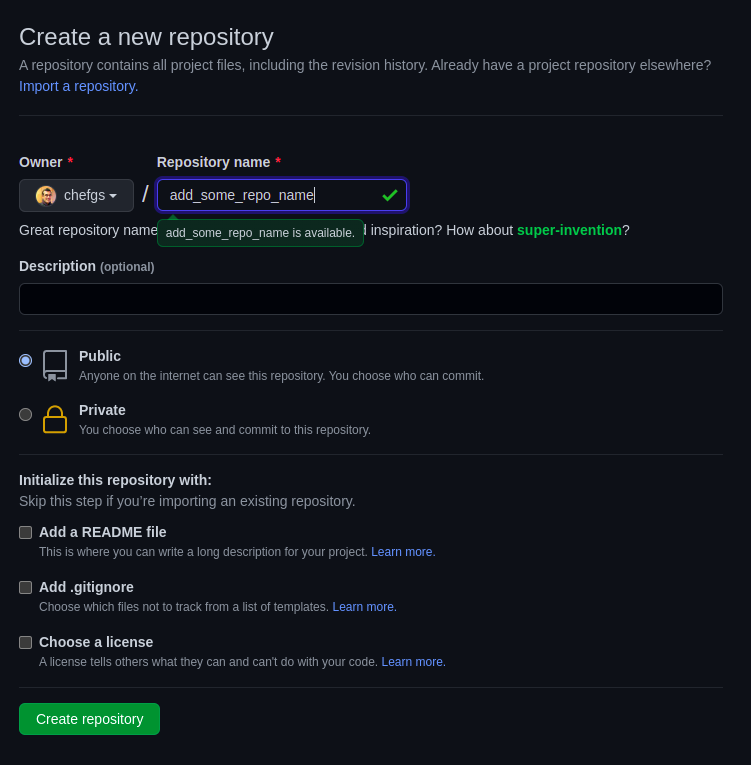
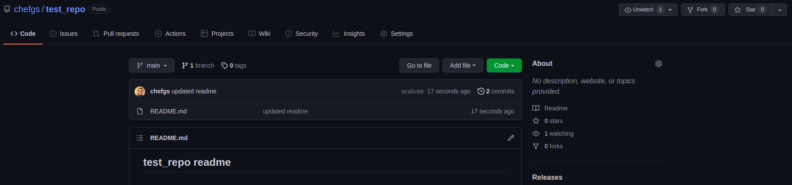

## test_repo readme

## Introduction
- This article is a Git-101 starter tutorial. I'm trying to provide the steps to create a repo locally and Git commands to initialzing and pushing the repo changes.
- I've used GitHub for demo purpose, and it is similar to all Git based source code management tools

## What we are trying to do?
- A new repository can either be created locally, or an existing repository can be cloned. In case a repository was created locally, user has to initialize and have to push it to GitHub afterwards
- Usecase for this article is,
  - An user having a set of files in a directory needs to be checked into Git
  - Files are stored in directory called `test_repo`
  - User wants to know, how to create repo in github website
  - Also Git commands associated with initializing the local repo and pushing the changes to github
- Also this article inspired by the [Git Cheat Sheet](https://training.github.com/downloads/github-git-cheat-sheet/) section `Create Repositories`


## Step 1 Create Repo in Github Website
- Login into Github
- Choose create repo 
- Fill-in the details in required field `Repository name` and optional field `Description`
- Then click create repo 


## Step 2 Copy the Repo Url from Address Bar
- Copy the Git repo url from browser address bar


## Step 3 Create a directory with similar repo name
```
mkdir test_repo
```

## Step 4 Go inside the directory
```
cd test_repo
```
## Step 6 Run Git init command to initialise .git directory
- The `git init` command turns an existing directory into a new Git repository inside the folder you are running this command.
```
git init
```

## Step 7 Create branch main
- After the [initiatives](https://inclusivenaming.org/word-lists/tier-1/) of `Inclusive naming convention`, it is recommended to use branch name as `main`, instead of `master`
- So the below command renames the branch master to main
```
git branch -m main
```

## Step 8 Now add the repo to remote Git URL
- After using the git init command, link the local repository to an empty GitHub repository using the following command:
```
git remote add origin https://github.com/chefgs/test_repo.git
```

## Step 9 Create a file
- Create a file named `README.md`
```
echo "## test_repo readme" > README.md
```

## Step 10 Check repo changes using git status
```
git status
```
## Step 11 Add the files to git staging
- Stages the file in preparation for versioning
```
git add .
```

## Step 12 Commit the staged files
- Records staged files permanently in version history
```
git commit -m "first commit"
```

## Step 13 Push the repo changes to Git
- Uploads all local branch commits to GitHub
```
git push --set-upstream origin main
```

- We can now see the repo updated with checked-in files


## Next steps
- Once changes are pushed for the first time, follow-up changes can be pushed by running below commands

## Check repo changes using git status
```
git status
```

## Add the files to git staging
```
git add .
```

## Commit the staged files
```
git commit -m "new commit message"
```

## Push the repo changes to Git
```
git push origin main
```